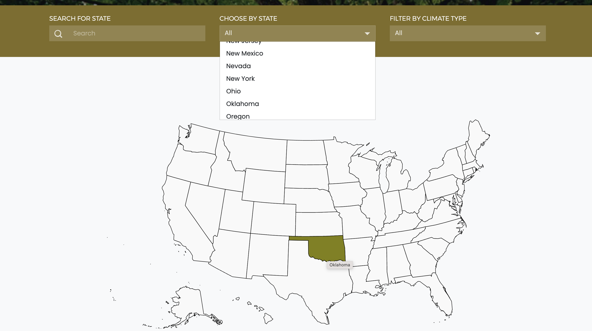
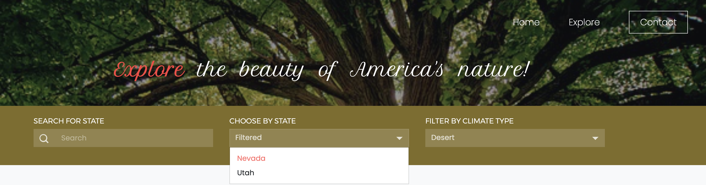

# Welcome to America's Natural Canvas 🌿

Welcome to our digital exhibit, **_"America's Natural Canvas,"_** where the beauty of each state's natural features becomes a captivating exploration. Dive into dreamlike descriptions that paint vivid scenes of majestic mountains, pristine coastlines, lush forests, and winding rivers. Our website invites you on an immersive journey state by state, capturing the essence of America's diverse landscapes.


## Table of Contents :pushpin:

- [About](#about) <br />
- [Explore](#explore) <br />
- [Tools](#tools)
- [Licenses](#licenses)
- [Contacts](#contacts)

## About

### _Discover the Beauty of America's Nature_ :sparkles:

This project is an implementation of the website from scratch, the result of the journey from conception to execution. The prototypes and wireframes were created on [visily](https://app.visily.ai/projects/64c37f8c-8f1a-4f64-9e14-e654ae55e834/boards/864774).

### _Directory Structure_ 📚

```
t3-final-garden_of_dreams/
| public/
| --- fonts/
| -------- ...
| --- images/
| -------- ...
| --- scripts/
| ------- ...
| --- styles/
| -------- ...
| --- index.html
| --- explore.html
| --- 404.html
| README.md
```

## Explore

 - **_Search for State_**  🔍 <br />
 Explore individual states and uncover their unique natural wonders.

 
 
 <br />
 
 - **_Choose by State_** ✅ <br />
 Select a state from the map or dropdown, dive into its climate, flora, and landmarks.

 

 <br />

 - **_Filter by Climate Type_** 🔦 <br />
 Find states based on their climate characteristics and discover how they shape their landscapes.

 

## Deployment :rocket:

**[Explore](https://america-s-natural-canvas.web.app/)** the website

## Tools

- Visily
- HTML
- CSS
- Bootstrap
- JavaScript
- jQuery
- Firebase

## Licenses

📜 This website was implemented for education purposes. The licenses for the data used is [here](https://docs.google.com/spreadsheets/d/1qZO1cP9twTAhIzQAGBQWuxjWoksDm-R2wyn5yShtKaE/edit?pli=1#gid=345038493)

## Contacts

* **Christopher Stephens** **|** [Github](https://github.com/Jtownokie) **|** [LinkedIn](https://www.linkedin.com/in/c-r-stephens/) **|** [Email](mailto:christopher.stephens@atlasschool.com)
* **Svitlana Pavlovska** **|** [Github](https://github.com/SvitLanaPavl) **|** [LinkedIn](https://www.linkedin.com/in/svitlana-pavlovska-833b43184/) **|** [Email](mailto:lanapavlovska90@gmail.com) **|** [Portfolio](https://svitlanapavl.github.io/Portfolio/)

##

